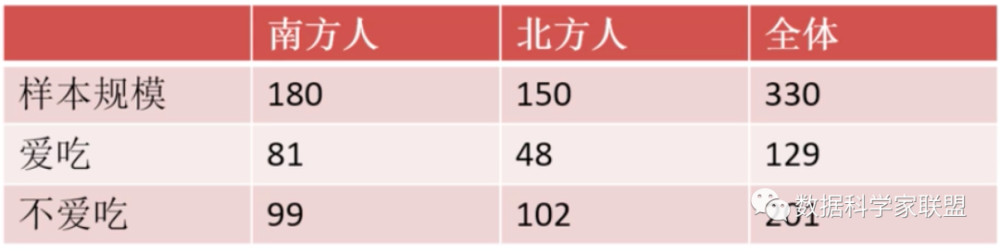
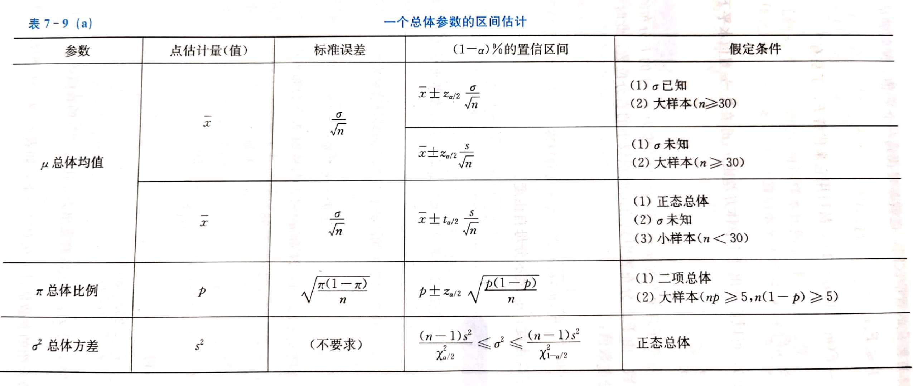

# 数据分析系列：Z检验和T检验的应用及代码实现

## 1. 前言

均值对比是数据分析中最重要的内容之一，应用广泛。

* 对比时延前后病人的症状，证明某种药是否有效；
* 对比某个班级两次语文成绩，验证是否有提高；
* 对比某个产品在投放广告前后的销量，看广告是否有效。

这些都属于两均值对比的应用。
均值对比的假设检验方法主要有Z检验和T检验，它们的区别在于Z检验面向总体数据和大样本数据，而T检验适用于小规模抽样样本。下面分别介绍Z检验和T检验。

## 2. Z检验

需要事先知道总体方差，另外，如果总体不服从正态分布，那么样本量要大于等于30；如果总体服从正态分布，那么对样本量没有要求。
Z检验用于比较样本和总体的均值是否不同或者两个样本的均值是否不同。检验统计量z值的分布服从正态分布。
问题：

* 是否一定要知道总体方差？Z检验的应用范围。
* 这里的服从正态分布，指的是统计量的抽样分布服从正态分布？中心极限定理。

### 2.1 单样本Z检验

使用单样本Z可以在知道总体的标准差时，估计总体的均值并将它与目标值或参考值进行比较。使用此分析，可以执行以下操作：确定总体均值是否不同于您指定的假设均值。计算可能包括总体均值的值范围。
例子：

* 质量分析员使用单样本Z检验来确定螺栓单平均螺纹长度是否不同于目标值39毫米。如果均值不同于目标值，分析员将使用置信区间来确定差值有可能为多大以及差值是否有实际意义；

实现代码：
```
import statsmodels.stats.weightstats as sw
arr = [
    23,36,42,34,39,34,35,42,53,28,
    49,39,46,45,39,38,45,27,43,54,
    36,34,48,36,47,44,48,45,44,33,
    24,40,50,32,39,31
]
tstats, pvalue = sw.ztest(arr, value=39)
print(tstats, pvalue)
# 输出：0.3859224924939799 0.6995540720244979
# 假设置信度为 0.05 ，由于 p 值大于置信度，接受原假设。所以平均螺纹长度等于 39 。
```

### 2.2 双样本Z检验

在两个总体标准差(s1和s2)已知的情况下，检验基于独立样本的两个总体均值(m1和m2)是否相等（或大于/小于）

实现代码：
```
import statsmodels.stats.weightstats as sw
arr1 = [
    23,36,42,34,39,34,35,42,53,28,
    49,39,46,45,39,38,45,27,43,54,
    36,34,48,36,47,44,48,45,44,33,
    24,40,50,32,39,31
]
arr2 = [
    41,34,36,32,32,35,33,31,35,34,
    37,34,31,36,37,34,33,37,33,38,
    38,37,34,36,36,31,33,36,37,35,
    33,34,33,35,34,34,34,35,35,34
]
tstats, pvalue = sw.ztest(arr1, arr2, value=0, alternative='two-sided')
print(tstats, pvalue)
# 3.775645601380307 0.0001595937672736755
# 假设置信度为 0.05 ，由于 p 值小于置信度 0.05 ，拒绝原假设，接受备选假设。所以两个独立样本的总体均值相等。
```

## 3. T检验

T检验，亦称student t检验(student's test)，主要用于样本含量小(n<30)，总体标准差未知的正态分布资料。T检验是用T分布理论来来推论差异发生的概率，从而比较两个平均数的差异是否显著。
事先不知道总体方差，另外，如果总体不服从正态分布，那么样本量要大于等于30，如果总体服从正态分布，那么对样本量没有要求。
Z检验虽然能够进行均值差异性检验，但是，它要求总体标准差已知或样本容量足够大，这是很难做到甚至无法达成的。这时候t检验就粉墨登场了，只需要从正态总体中抽取小规模的样本数据，并计算均值与标准差，用来代替正态总体的均值和标准差即可。

### 3.1 单样本 T 检验

单样本T检验确定样本均值是否与已知或假设的总体均值具有统计学差异。
例子：

* 你有 10 个年龄，你正在检查平均年龄是否为 30 岁；

实现代码：
```
from scipy import stats
arr = [31, 35, 28, 29, 27, 34, 32, 33, 30, 26]
statistic, pvalue = stats.ttest_1samp(arr, 30)
print('statistic={}, pvalue={}'.format(statistic, pvalue))
# 输出：statistic=0.5222329678670935, pvalue=0.614117254808394
# 假设置信度为 0.05 ，由于 p 值大于置信度 0.05 ，接受原假设。所以 arr 的均值与 30 差异不显著。
```

### 3.2 双样本T检验

独立样本T检验或双样本T检验比较两个独立组的平均值，以确定是否有统计证据表明相关人口均值存在显著差异。独立样本T检验是参数检验。该测试也称为：独立T检验。

1）独立均值T检验
例子：

* 研究表达性写作对创伤事件的治愈效果（ABTest）；
* 用T检验比较下列男、女儿童身高的均值是否一样；

实现代码：
```
import statsmodels.stats.weightstats as st
arr1 = [8, 7, 9, 6, 8]
arr2 = [6, 7, 7, 6, 6]
# usevar='unequal'两个总体方差不一样
t, p, df = st.ttest_ind(arr1, arr2, alternative='two-sided', usevar='unequal')
print('t值={}，p值={}，自由度={}'.format(t, p, df))
# 输出：t值=2.1213203435596415，p值=0.08011884223003829，自由度=5.752808988764045
# 假设置信度为 0.05 ，由于 p 值大于置信度 0.05 ，接受原假设。所以 arr1 与 arr2 的均值没有差异。
```

2）非独立（配对样本）均值T检验
例子：

* 检验运动前和运动后同一批人的体重是否有变化。
* 检验 5 位丈夫结婚前后交流质量是否有变化。

实现代码：
```
from scipy import stats
arr1 = [8, 7, 9, 6, 8]
arr2 = [6, 7, 7, 6, 6]
statistic, pvalue = stats.ttest_rel(arr1, arr2)
print('statistic={}, pvalue={}'.format(statistic, pvalue))
# 输出：statistic=2.449489742783178, pvalue=0.07048399691021993
# 假设置信度为 0.05 ，由于 p 值大于置信度 0.05 ，接受原假设。所以 arr1 与 arr2 所代表的总体均值相等。
```
注：Z 分布与 T 分布，是两个分布，概率函数公式的存在差异，T 分布较 Z 分布多了一个自由度的变量，惩罚小样本，增加其拒绝 H0 的难度，因而小样本采用 T 检验，优于 Z 检验。

## 4. 比例检验

### 4.1 单比例检验

计算未知成功比例(prop)的检验。它将样本x中的成功计数和样本n中的观察计数作为输入，比较样本(p0)和总体(prop)的比例是否相同，以此来检验样本和总体之间的差异性。
零假设

* H0: prop=p0
* H0: prop<p0
* H0: prop>p0

例子：

* 汽车制造商声称不安全的汽车不超过 10％ ，检查了 15 辆汽车的安全性，发现 3 辆不安全，通过假设检验判断不安全汽车的概率是否不超过 10% 。

实现代码
```
# 显著性水平 α = 0.05 ，原假设 H0 ：汽车不安全性小于 0.1 ；备择假设 H1 ：汽车不安全性大于 0.1
from statsmodels.stats.proportion import proportions_ztest
stat, pval = proportions_ztest(3, 15, 0.1, alternative='larger')
print('{0:0.4f}'.format(pval))
# 输出：0.1664
# 由于p大于0.05，接受原假设。
```

### 4.2 双比例检验

计算检验以比较两个总体的成功比例（p1 和 p2）。它将每个样本中的成功计数（x1 和 x2）和每个样本中的观察计数（n1 和 n2）作为输入。
零假设：

* H0: p1 = p2
* H0: p1 < p2
* H0: p1 > p2

例子：

* 调查南方人还是北方人更喜欢吃甜豆花


实现代码：
```
from statsmodels.stats.proportion import proportions_ztest
# H0：假设南方人和北方人爱吃甜豆花的比例没有差异；H1：假设南方人和北方人爱吃甜豆花的比例有差异；
z_score, p_value = sp.proportions_ztest(
    [81, 48], [180, 150], alternative='two-sided')
print('p_value={}'.format(p_value))
print(z_score, p_value)
# 输出：0.0160
# 由于 p 小于 0.05 ，接受备选假设，南方人与北方人在喜爱吃甜豆花的比例上有显著差别，南方人爱吃甜豆花比例更高。
```

## 5. 总结

* Z 分布和 T 分布
* Z 检验和 T 检验的区别
  * Z 检验用于大样本(n > 30)，或总体方差已知；
  * T 检验用于小样本(n < 30)，且总体方差未知时，适用性优于 Z 检验，而在大样本时，Z 检验和 T 检验的结论趋同。

* 常见公式


